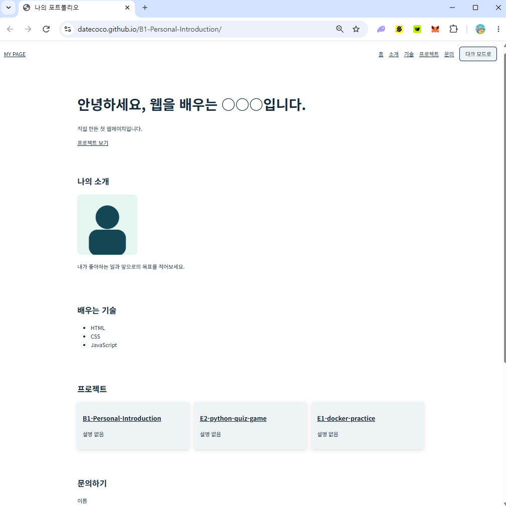
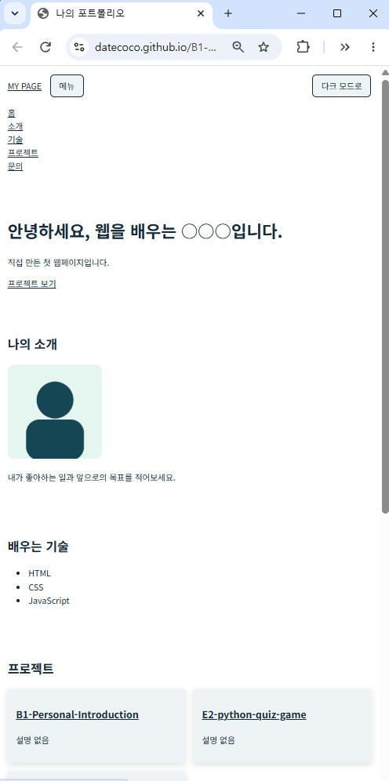
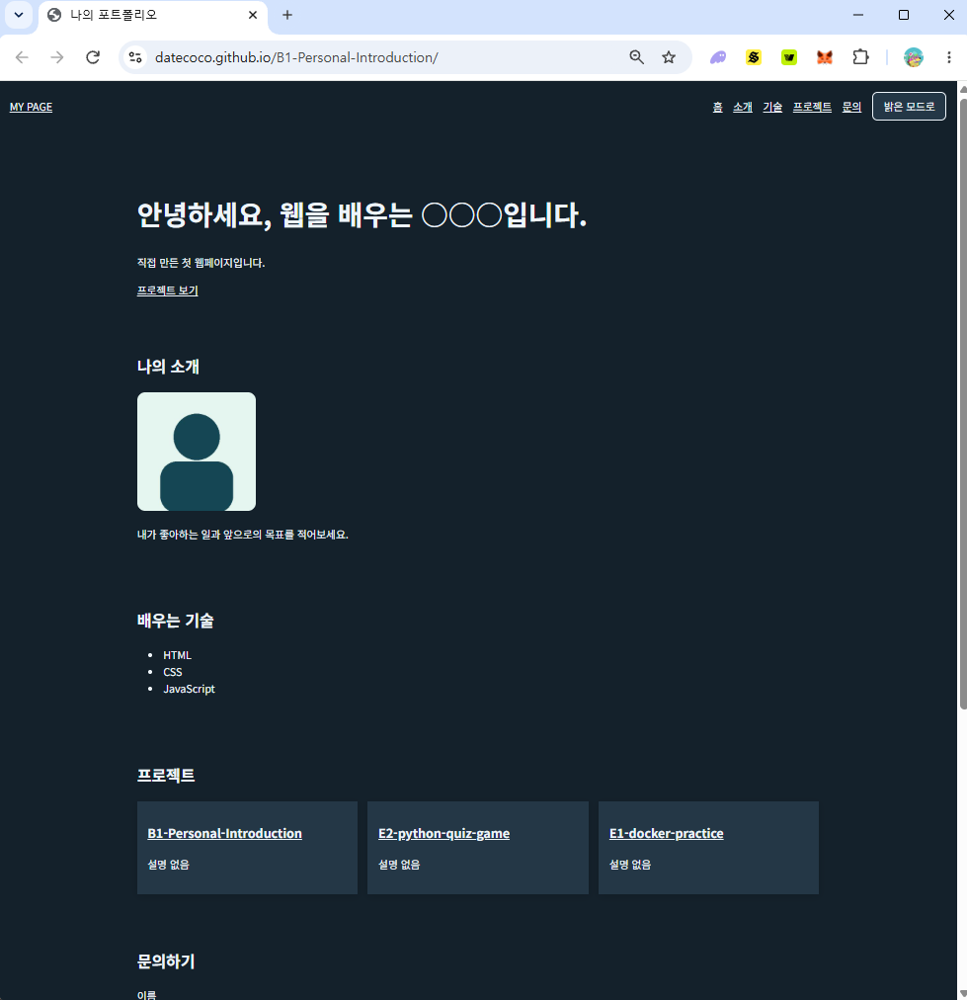

# 🌐 나를 소개하는 웹페이지

순수 HTML, CSS, JavaScript로 제작한 반응형 자기소개 웹페이지입니다.

웹 기초 학습을 위해 시맨틱 HTML, 반응형 CSS, JavaScript 이벤트 처리, GitHub API 연동을 직접 구현했습니다.

---

## 🚀 배포 주소

- GitHub Repository: https://github.com/datecoco/B1-Personal-Introduction
- GitHub Pages: https://datecoco.github.io/B1-Personal-Introduction/

---

## ✨ 기능 목록

| 기능 | 설명 |
| --- | --- |
| 📱 반응형 메뉴 | 모바일에서는 햄버거 메뉴, 넓은 화면에서는 가로 메뉴를 표시합니다. |
| 🌙 다크 모드 | 버튼으로 테마를 바꾸고, 선택한 설정을 `localStorage`에 저장합니다. |
| ⬇️ 부드러운 이동 | 메뉴를 누르면 각 섹션으로 자연스럽게 이동합니다. |
| 🔝 맨 위로 버튼 | 일정 거리 이상 스크롤하면 버튼이 나타나고, 누르면 페이지 위로 이동합니다. |
| ✨ 등장 애니메이션 | 섹션 제목이 화면에 들어오면 자연스럽게 나타납니다. |
| 📝 문의 폼 검사 | 이름, 이메일, 메시지의 빈칸과 이메일 형식을 검사합니다. |
| 📦 GitHub 프로젝트 | GitHub API로 공개 저장소를 가져와 프로젝트 카드로 표시합니다. |
| ⏳ 상태별 안내 | 프로젝트 로딩, 성공, 오류, 빈 결과 상태를 화면에 보여줍니다. |

---

## 🛠 사용 기술

- HTML5
- CSS3
- JavaScript
- GitHub REST API
- GitHub Pages

---

## 📁 파일 구조

```text
B1-Personal-Introduction
├── index.html
├── README.md
├── css
│   └── style.css
├── js
│   └── main.js
├── images
│   └── profile.jpg
└── screenshots
    ├── desktop.png
    ├── mobile-menu.png
    └── dark-mode.png
```

---

## 💡 주요 학습 내용

- `header`, `nav`, `main`, `section`, `footer`를 활용한 시맨틱 HTML
- Flexbox와 CSS Grid를 이용한 반응형 화면 구성
- `querySelector()`, `addEventListener()`를 이용한 DOM 조작
- `classList.toggle()`을 이용한 모바일 메뉴 구현
- `localStorage`를 이용한 다크 모드 설정 유지
- `IntersectionObserver`를 이용한 스크롤 애니메이션
- 폼 입력값 검사와 오류 메시지 표시
- `fetch()`, `async/await`, `try/catch`를 이용한 GitHub API 요청
- `map()`을 이용한 GitHub 저장소 카드 생성

---

## 🔄 GitHub API 처리 흐름

```text
GitHub 공개 저장소 요청
↓
로딩 메시지 표시
↓
저장소 데이터 수신
↓
저장소 이름과 설명을 프로젝트 카드로 변환
↓
Projects 섹션에 표시
```

---

## 📸 실행 화면

### 데스크톱



### 모바일 메뉴



### 다크 모드



---

## ▶ 실행 방법

1. 프로젝트 폴더를 VS Code에서 엽니다.
2. `index.html` 파일을 엽니다.
3. Live Server로 실행합니다.
```